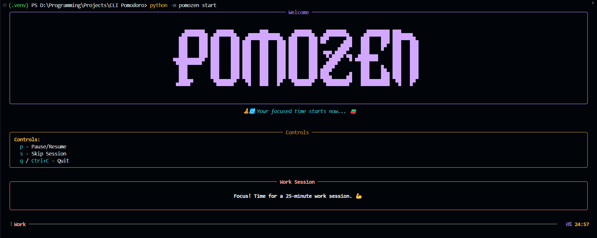

# PomoZen 🧘‍♂️🍅

**A simple, stylish, and effective Pomodoro timer for your terminal.**

PomoZen helps you focus using the Pomodoro Technique by managing work and break timers directly in your command line. It provides visual feedback and keyboard controls without needing a separate application.

## 

## Features

- **Classic Pomodoro:** Manages work, short break, and long break cycles.
- **Clear Terminal UI:** Uses live progress bars and clean session banners.
- **Interactive Controls:** Pause, resume, skip sessions, or quit using simple keys.
- **Customizable:** Change timer durations and other settings easily.
- **Notifications:** Optional desktop and sound alerts when sessions end.
- **Lightweight:** Runs directly in your terminal with minimal dependencies.

---

## Installation

**Requirements:**

- Python (version 3.8 or newer recommended)
- `pip` (Python's package installer)

**Steps:**

1.  **Get the Code:**

    ```bash
    git clone https://github.com/MohamedTyr/pomozen
    cd pomozen
    ```

2.  **Set up a Virtual Environment (Recommended):**

    ```bash
    # Create it
    python -m venv .venv
    # Activate it
    # Windows: .venv\Scripts\activate  (cmd/PowerShell)
    # macOS/Linux: source .venv/bin/activate
    ```

3.  **Install Required Packages:**
    ```bash
    pip install -r requirements.txt
    ```
    - _Note:_ Desktop/sound alerts might need extra setup depending on your system. Sound is off by default.

---

## Quick Start & Usage

**Run the Timer:**

```bash
# Make sure you are in the pomozen directory and your virtual environment is active
python -m pomozen start
```

**Keyboard Controls (While Timer is Running):**

| Key        | Action         |
| :--------- | :------------- |
| `p`        | Pause / Resume |
| `s`        | Skip Session   |
| `q`        | Quit PomoZen   |
| `Ctrl + C` | Quit PomoZen   |

**Command Reference:**

| Command                                     | Description                                  | Example                                     |
| :------------------------------------------ | :------------------------------------------- | :------------------------------------------ |
| `python -m pomozen start`                   | Start the Pomodoro timer sequence.           | `python -m pomozen start`                   |
| `python -m pomozen start -a`                | Start timer & auto-continue to next session. | `python -m pomozen start -a`                |
| `python -m pomozen config`                  | Show current settings & config file path.    | `python -m pomozen config`                  |
| `python -m pomozen config --create-default` | Create a default config file if missing.     | `python -m pomozen config --create-default` |
| `python -m pomozen set <setting> <value>`   | Change a specific setting.                   | `python -m pomozen set work 30`             |
| `python -m pomozen --help`                  | Show general help and list all commands.     | `python -m pomozen --help`                  |
| `python -m pomozen <command> --help`        | Show help for a specific command.            | `python -m pomozen start --help`            |

_(If you install PomoZen globally via `pip install .`, you can replace `python -m pomozen` with just `pomozen` in the commands above.)_

---

## Configuration

PomoZen stores settings in a `config.toml` file.

**Config File Location:**

- **Linux:** `~/.config/pomozen/config.toml`
- **macOS:** `~/Library/Application Support/pomozen/config.toml`
- **Windows:** `%APPDATA%\pomozen\config.toml` (e.g., `C:\Users\You\AppData\Roaming\pomozen\config.toml`)

**Changing Settings:**

1.  **Use the `set` command (Easiest):**
    ```bash
    python -m pomozen set <setting_name> <new_value>
    ```
2.  **Edit `config.toml` directly:** Create the file first if needed (`pomozen config --create-default`), then open it in a text editor.

**Available Settings:**

| Setting                        | Description                          | Default | Example `set` Command                           |
| :----------------------------- | :----------------------------------- | :------ | :---------------------------------------------- |
| `durations.work`               | Work session length (minutes)        | `25`    | `python -m pomozen set work 30`                 |
| `durations.short_break`        | Short break length (minutes)         | `5`     | `python -m pomozen set short_break 7`           |
| `durations.long_break`         | Long break length (minutes)          | `15`    | `python -m pomozen set long_break 20`           |
| `settings.long_break_interval` | Work sessions before a long break    | `4`     | `python -m pomozen set long_break_interval 3`   |
| `settings.sound_notification`  | Enable sound alerts (`true`/`false`) | `false` | `python -m pomozen set sound_notification true` |

## License

MIT License - See the [LICENSE](LICENSE) file for details.
